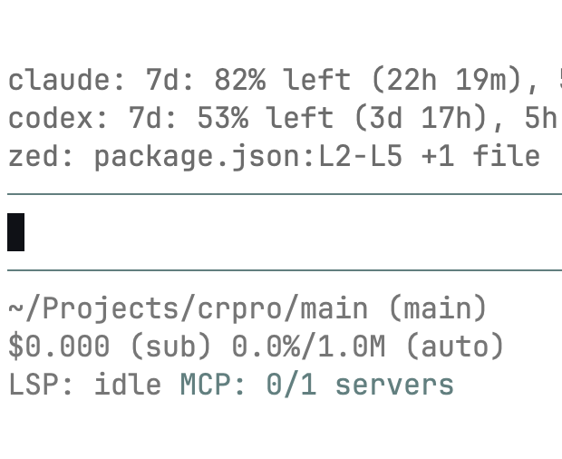

# pi-zed

Zed editor context extension for pi.



## Install

```bash
pi install npm:@ravshansbox/pi-zed
```

## Usage

Pi loads the extension from `./index.ts`. It reads Zed's local SQLite state and:

- shows a compact muted widget with the current Zed active file, selected line range, and count of other open files
- injects active file, open files, selected line numbers, and selected text into each pi prompt as hidden untrusted context
- registers `zed_current_context`, `zed_open_files`, and `zed_selected_lines`

It requires the `sqlite3` CLI.

## Configuration

Set `PI_ZED_DB` to override the Zed database path. If unset, the extension tries:

- `$OPENCODE_ZED_DB`
- `~/Library/Application Support/Zed/db/0-stable/db.sqlite`
- `~/.local/share/zed/db/0-stable/db.sqlite`

## Development

```bash
npm install
npm run check
```
